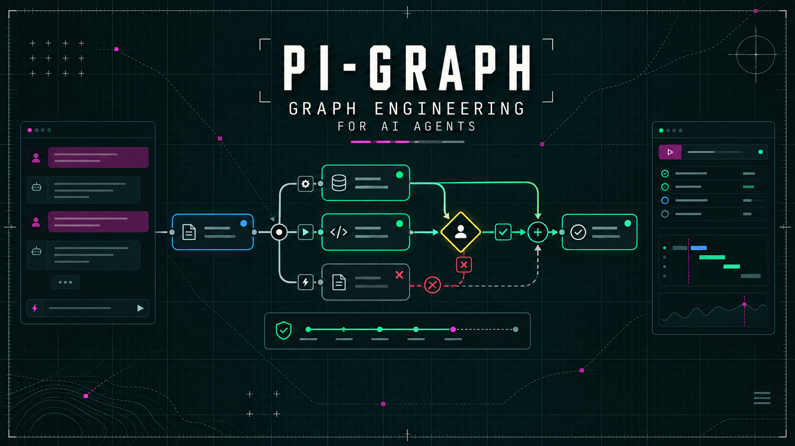
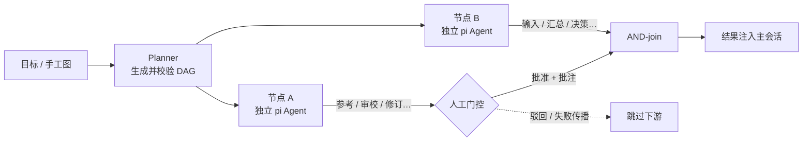
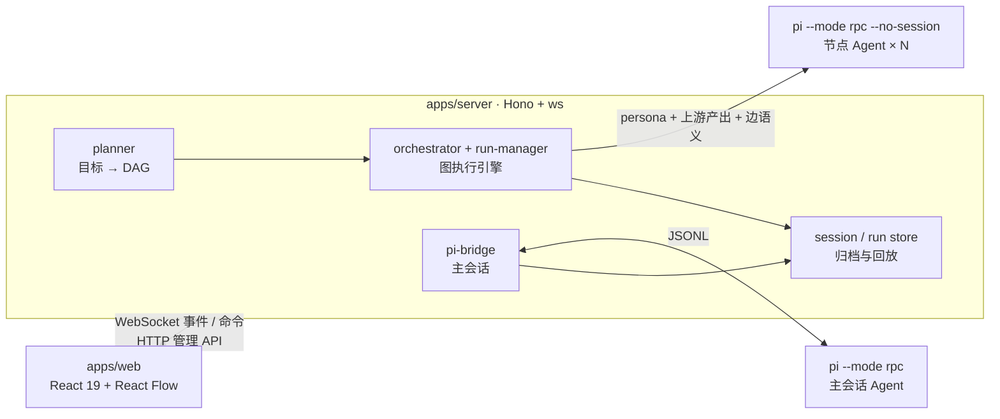

# PI-GRAPH



<p align="center">
  <strong>Graph Engineering for AI Agents</strong><br/>
  把 Agent 工作流建模为可编辑、可执行、可观测、可复盘的图。
</p>

<p align="center">
  = 20" src="https://img.shields.io/badge/Node-%E2%89%A5%2020-339933">
  
  
  
  
  
</p>

PI-GRAPH 是 [pi coding agent](https://github.com/badlogic/pi-mono) 的图工程工作台。它不只是把 Agent 的调用过程“画出来”，还把任务依赖、上下文流向、人工决策和失败策略变成一张真正可以执行的 DAG。

你可以观察主会话如何调用工具与派生子 Agent，也可以手工搭建任务图，或只输入一个目标，让规划器生成图后执行。图中的每个执行节点都是独立的 pi Agent 进程。

## 为什么是 Graph Engineering？

一个可用的 Agent 图，不只是节点和连线。PI-GRAPH 把工作流里最难处理的工程约束放进图模型与运行时：

| 图工程能力 | PI-GRAPH 的实现 |
|---|---|
| 任务建模 | 可视化编辑节点、依赖和执行参数；支持模板与 AI 自动拆图 |
| 语义传递 | 输入、参考、审校、修订、汇总、决策六类边，把关系语义注入下游提示词 |
| 并发与汇聚 | 独立 Agent 进程并行执行；AND-join 等待全部上游完成后再汇聚 |
| 人工门控 | 节点可挂起等待批准或驳回，人工批注会原样进入下游上下文 |
| 失败语义 | 失败沿依赖图传播并跳过不可达节点，避免继续消耗 token |
| 运行保障 | 并发上限、节点超时、进程树回收、输出质量门与自动补救重试 |
| 可观测与复盘 | 流式状态、节点输出、token、耗时、归档与稳定布局完整保留 |

## 快速开始

### 前置条件

- Node.js 20 或更高版本
- pnpm
- pi CLI：`npm install -g @earendil-works/pi-coding-agent`
- 至少一个可用的模型 Provider 与 API Key

### 安装与启动

```bash
pnpm install
node scripts/check-env.mjs
node scripts/dev.mjs
```

打开 [http://localhost:5173](http://localhost:5173)。`dev.mjs` 会同时启动桥接服务（`:8787`）和前端（`:5173`），按 `Ctrl+C` 可一起退出。

首次使用时，在「模型」页面选择 pi 内置 Provider 或新增 OpenAI 兼容端点，填写密钥、测试连接并应用。密钥只写入仓库根目录、已被 Git 忽略的 `.env`；`models.json` 保存的是环境变量引用。

如果进程被强制结束后仍有端口残留，可以运行：

```bash
node scripts/stop.mjs
```

<details>
<summary>手工配置 Provider 与 subagent 扩展</summary>

也可以在 `~/.pi/agent/models.json` 手工定义 Provider：

```json
{
  "providers": {
    "deepseek": {
      "baseUrl": "https://api.deepseek.com/v1",
      "api": "openai-completions",
      "apiKey": "$DEEPSEEK_API_KEY",
      "models": [
        { "id": "deepseek-chat" },
        { "id": "deepseek-reasoner" }
      ]
    }
  }
}
```

并行扇出依赖 pi 的 subagent 扩展。自定义 Agent 定义放在 `~/.pi/agent/agents/*.md`，会自动出现在编排节点的 `@agent` 选择器中。

```bash
cp -r "$(npm root -g)/@earendil-works/pi-coding-agent/examples/extensions/subagent" \
  ~/.pi/agent/extensions/
```

</details>

## 核心工作流

### 1. 从目标到可执行图

在编排页输入目标，规划器会流式生成任务 DAG；也可以从空白画布或内置模板开始，手工调整节点、语义边、Agent、工具权限、超时和输出预算。


### 2. 在图上执行、门控与汇聚

运行时按拓扑依赖调度节点，在并行上限内启动独立 pi 进程。门控节点等待人工决策，汇聚节点执行 AND-join，失败节点触发下游跳过。布局按内容签名保持稳定，不会因流式更新反复跳动。


### 3. 从会话反向观察图

实时页以对话为主线，把用户消息、工具调用、助手输出和子 Agent 扇出派生为图。开启 ⚡ 后，输入框会切换为自动编排入口；图执行完成后，节点结果会注入主会话，由主 Agent 汇总成最终回答。


### 4. 恢复完整工作现场

会话侧栏支持新建、重命名、删除、只读回放和上下文恢复。恢复会同时切换 pi 的模型上下文，而不是只重放界面事件；刷新或断线重连也能恢复进行中的运行状态。


## 图执行语义



- 调度器只运行所有上游都成功的节点。
- 多个前驱构成 AND-join；上游输出按语义边类型编译进下游提示词。
- 驳回、失败或超时会沿图传播，跳过已经不可执行的后继节点。
- `ORCH_MAX_PARALLEL` 控制并发，`ORCH_NODE_TIMEOUT_MS` 控制节点超时。
- `ORCH_MIN_OUTPUT_CHARS` 可开启输出质量门；不达标时原题重跑一次并保留更长答案。
- 中止会终止规划器与所有节点进程树，避免孤儿进程继续消耗资源。

## 架构



仓库采用 pnpm workspace：

```text
packages/shared   事件类型、图模型、编排纯函数、折叠器、模板与单测
apps/server       主会话桥接、规划器、图执行引擎、会话与运行归档、HTTP/WS API
apps/web          实时会话、图编辑器、运行视图、模型配置与会话侧栏
scripts           开发、自检、停止和端到端验证脚本
docs              架构调研、设计说明与 README 图片
```

## 配置

| 变量 | 作用 | 默认值 |
|---|---|---|
| `PI_BIN` | pi 可执行文件 | `pi` |
| `PI_CWD` | pi 工作目录 | 当前目录 |
| `PI_ARGS` | 主会话 pi 的额外参数 | 空 |
| `PI_NO_SESSION` | 设为 `1` 时禁用可恢复的 pi 会话文件 | 未设置 |
| `PORT` | 桥接服务端口 | `8787` |
| `VITE_WS_URL` | 前端 WebSocket 地址覆盖 | 同源推导 |
| `ORCH_MAX_PARALLEL` | 图节点并行上限 | `4` |
| `ORCH_MODEL` | 节点默认模型 | 页面持久默认；否则 `deepseek/deepseek-chat` |
| `ORCH_PLANNER_MODEL` | 规划器模型 | 与 `ORCH_MODEL` 相同 |
| `ORCH_NODE_TIMEOUT_MS` | 单节点超时 | `600000` |
| `ORCH_PLAN_TIMEOUT_MS` | 规划超时 | `180000` |
| `ORCH_MIN_OUTPUT_CHARS` | 输出质量门阈值，`0` 表示关闭 | `0` |
| `ORCH_NODE_RETRY` | 质量门违规时是否补救重试 | 开启 |
| `ALLOWED_HOSTS` / `TRUSTED_ORIGINS` | 额外允许的 Host 与 Origin | 本机与私网安全默认值 |
| `SNAKE_DEMO` | 设为 `0` 时关闭桥接服务上的演示页 | 开启 |

节点还支持 `minOutputChars`、`timeoutMs`、`outputCapBytes`、`workdir`、`tools` 和 `excludeTools` 等覆盖项，详见 [Server 文档](apps/server/README.md)。

## 验证

```bash
pnpm -r test
pnpm -r typecheck
```

需要运行中的桥接服务与可用模型 Key 的端到端检查：

```bash
node scripts/e2e-smoke.mjs
node scripts/e2e-orch.mjs
node scripts/e2e-parallel.mjs
node scripts/e2e-gate.mjs
node scripts/e2e-reset.mjs
node scripts/e2e-sessions.mjs
node scripts/verify-sessions-ui.mjs
```

相关开关：`PLAN=1` 验证自动拆图，`CHAT=1` 验证结果注入主会话，`ABORT=1` 验证中止与进程回收。完整覆盖范围见 [TESTCASES.md](TESTCASES.md)。

## 当前边界

- 实时会话图仍会在每次事件后做全量 dagre 布局，大图可能跳动；编排运行图已使用稳定布局。
- 同一会话多次编排时，聊天流只保留最新运行卡片；历史注入消息仍在 transcript 中。
- 会话列表会读取归档头部生成摘要，归档达到数百个后需要为摘要建立索引缓存。
- 尚未实现 PNG/SVG 导出、按节点与单价计算费用，以及多会话联合画布。
- 窄屏小于约 650px 时，分栏拖动空间有限。

## 延伸阅读

- [Server 与节点执行器](apps/server/README.md)
- [架构与设计决策](PLAN.md)
- [完整测试用例](TESTCASES.md)
- [桥接服务装配与协议调研](docs/bridge-server.md)
