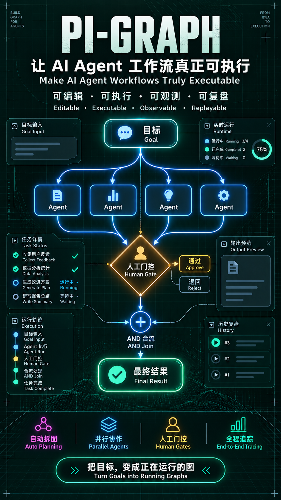
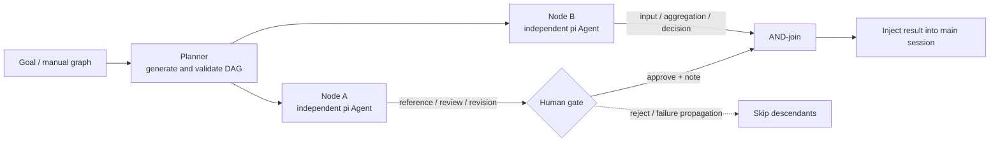
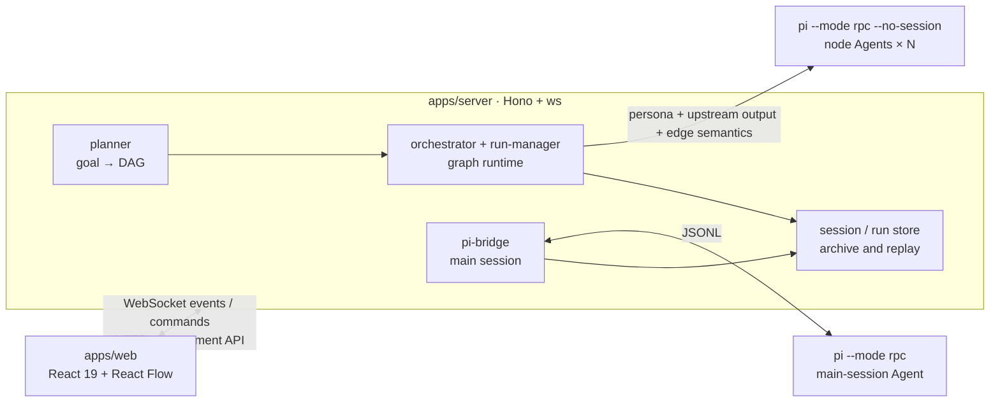

# PI-GRAPH

<p align="center">
  <a href="README.md">中文</a> · English
</p>



<p align="center">
  <strong>Graph Engineering for AI Agents</strong><br/>
  Model Agent workflows as editable, executable, observable, and replayable graphs.
</p>


PI-GRAPH is a graph engineering workbench for [pi coding agent](https://github.com/badlogic/pi-mono). It turns task dependencies, context flow, human decisions, and failure policies into an executable DAG.

Use it to inspect how a main session calls tools and spawns subagents, build a workflow by hand, or give the planner a goal and let it generate the graph. Every execution node runs as an independent pi Agent process.

## Why Graph Engineering?

A useful Agent graph needs more than nodes and lines. PI-GRAPH puts the hard workflow constraints into the graph model and its runtime:

| Graph engineering capability | How PI-GRAPH handles it |
|---|---|
| Task modeling | Edit nodes, dependencies, and execution settings visually; start from templates or an AI-generated plan |
| Semantic context flow | Six typed edges—input, reference, review, revision, aggregation, and decision—compile relationship context into downstream prompts |
| Parallelism and joins | Run independent Agent processes in parallel; use AND-join semantics to wait for every upstream dependency |
| Human-in-the-loop gates | Pause a node for approval or rejection and pass the reviewer's note into downstream context |
| Failure semantics | Propagate failures through the graph and skip unreachable nodes instead of spending more tokens |
| Runtime safeguards | Enforce concurrency limits, node deadlines, process-tree cleanup, output quality gates, and salvage retries |
| Observability and replay | Preserve streamed state, node output, token use, duration, archives, and stable run layouts |

## Quick start

### Requirements

- Node.js 20 or later
- pnpm
- pi CLI: `npm install -g @earendil-works/pi-coding-agent`
- At least one configured model provider and API key

### Install and run

```bash
pnpm install
node scripts/check-env.mjs
node scripts/dev.mjs
```

Open [http://localhost:5173](http://localhost:5173). The development script starts the bridge on `:8787` and the web app on `:5173`; `Ctrl+C` stops both.

On first run, open the Models page. Choose one of pi's built-in providers or add an OpenAI-compatible endpoint, enter the API key, test the connection, and apply it. Secrets are written only to the repository's Git-ignored `.env` file. `models.json` stores environment-variable references.

If a forced shutdown leaves either port occupied, run:

```bash
node scripts/stop.mjs
```

<details>
<summary>Manual provider and subagent setup</summary>

You can define a provider directly in `~/.pi/agent/models.json`:

```json
{
  "providers": {
    "deepseek": {
      "baseUrl": "https://api.deepseek.com/v1",
      "api": "openai-completions",
      "apiKey": "$DEEPSEEK_API_KEY",
      "models": [
        { "id": "deepseek-chat" },
        { "id": "deepseek-reasoner" }
      ]
    }
  }
}
```

Parallel fan-out uses pi's subagent extension. Put custom Agent definitions in `~/.pi/agent/agents/*.md`; they appear in the graph editor's `@agent` selector.

```bash
cp -r "$(npm root -g)/@earendil-works/pi-coding-agent/examples/extensions/subagent" \
  ~/.pi/agent/extensions/
```

</details>

## Core workflow

### 1. Turn a goal into an executable graph

Enter a goal on the orchestration page and the planner streams a task DAG. You can also start with a blank canvas or built-in template, then edit nodes, typed edges, Agent assignments, tool permissions, deadlines, and output budgets.

[View the graph editor](docs/images/orch-editor.png)

### 2. Execute, gate, and join on the graph

The runtime schedules nodes from their topological dependencies and launches independent pi processes within the concurrency limit. Gate nodes wait for a human decision, join nodes wait for every required predecessor, and failed nodes cause unreachable descendants to be skipped. Content-signature layouts stay fixed while output streams in.

[View an executed DAG](docs/images/orch-run.png)

### 3. Derive a graph from a live session

The live page treats the conversation as the main timeline and derives graph nodes from user messages, tool calls, assistant output, and subagent fan-out. Turn on ⚡ to use the prompt box as an automatic orchestration entry point. When the graph finishes, node results return to the main session for a final synthesized answer.

[View the live session graph](docs/images/live-session.png)

### 4. Restore the full working context

The session sidebar supports creation, rename, deletion, read-only replay, and context restoration. Restoring a session switches pi's model context as well as replaying its UI events. Refreshes and reconnects also restore an active run.

[View session management](docs/images/sessions-sidebar.png)

## Execution semantics



- A node runs only after all of its upstream dependencies succeed.
- Multiple predecessors form an AND-join. Upstream output is compiled into the downstream prompt according to edge type.
- Rejection, failure, and timeout propagate through the graph and skip descendants that can no longer run.
- `ORCH_MAX_PARALLEL` controls concurrency; `ORCH_NODE_TIMEOUT_MS` sets the node deadline.
- `ORCH_MIN_OUTPUT_CHARS` enables an output quality gate. A short result is retried once with the original prompt, and the longer answer is kept.
- Transient node failures (timeout / process / model) auto-retry once by default; a failed run can be partially re-run reusing finished outputs, or a failed node can be rewritten by AI and re-run (see the next section).
- Aborting a run terminates the planner and every node process tree.

## Failure recovery

Three layers, from lightest to heaviest:

1. **Auto-retry**: timeout / process-exit / model failures re-run per `ORCH_NODE_MAX_RETRIES` (default 1; per-node `maxRetries` overrides, 0–3). Intermediate attempts emit only `node_retry` (the canvas shows a ↻n/N badge) — never `node_failed` — so a successful retry still turns the node green. Config errors and aborts are never retried; every retry gets a fresh timeout budget.
2. **Re-run the failed part**: one click starts a fresh run of a failed/aborted one — completed nodes' outputs are reused (「复用」 badge, never re-executed) while only the failed/skipped remainder and its descendants re-execute. Source material comes from the run archive, so this survives a server restart.
3. **AI repair**: the failed node's panel offers to have the planner rewrite its task with the error and upstream outputs as context (it may also adjust the model/tools); after a streamed preview of the rewrite, only that node re-runs while every other output stays reused.

## Architecture



The repository is a pnpm workspace:

```text
packages/shared   Event types, graph model, orchestration functions, reducers, templates, and tests
apps/server       Main-session bridge, planner, graph runtime, archives, and HTTP/WS APIs
apps/web          Live sessions, graph editor, run view, model settings, and session sidebar
scripts           Development, environment checks, cleanup, and end-to-end verification
docs              Architecture research, design notes, and README images
```

## Configuration

| Variable | Purpose | Default |
|---|---|---|
| `PI_BIN` | pi executable | `pi` |
| `PI_CWD` | pi working directory | Current directory |
| `PI_ARGS` | Extra arguments for the main-session pi process | Empty |
| `PI_NO_SESSION` | Set to `1` to disable resumable pi session files | Unset |
| `PORT` | Bridge server port | `8787` |
| `VITE_WS_URL` | Override the frontend WebSocket URL | Derived from the current origin |
| `ORCH_MAX_PARALLEL` | Maximum number of graph nodes running in parallel | `4` |
| `ORCH_MODEL` | Default node model | Saved UI default, otherwise `deepseek/deepseek-chat` |
| `ORCH_PLANNER_MODEL` | Planner model | Same as `ORCH_MODEL` |
| `ORCH_NODE_TIMEOUT_MS` | Node deadline | `600000` |
| `ORCH_PLAN_TIMEOUT_MS` | Planning deadline | `180000` |
| `ORCH_MIN_OUTPUT_CHARS` | Output quality threshold; `0` disables it | `0` |
| `ORCH_NODE_RETRY` | Retry output that misses the quality gate | Enabled |
| `ORCH_NODE_MAX_RETRIES` | Auto-retries for failed nodes (timeout/process/model only; per-node `maxRetries` overrides) | `1` (0–3) |
| `ORCH_NODE_RETRY_DELAY_MS` | Delay between failure retries, in milliseconds | `2000` |
| `ALLOWED_HOSTS` / `TRUSTED_ORIGINS` | Additional allowed hosts and origins | Safe local and private-network defaults |
| `SNAKE_DEMO` | Set to `0` to disable the bridge demo page | Enabled |

Nodes can override `minOutputChars`, `timeoutMs`, `outputCapBytes`, `workdir`, `tools`, `excludeTools`, and `maxRetries`. See the [server documentation](apps/server/README.md) for details.

## Verification

```bash
pnpm -r test
pnpm -r typecheck
```

The end-to-end checks below require a running bridge and a valid model key:

```bash
node scripts/e2e-smoke.mjs
node scripts/e2e-orch.mjs
node scripts/e2e-parallel.mjs
node scripts/e2e-gate.mjs
node scripts/e2e-reset.mjs
node scripts/e2e-sessions.mjs
node scripts/verify-sessions-ui.mjs
```

Use `PLAN=1` to test automatic graph planning, `CHAT=1` to test result injection into the main session, and `ABORT=1` to test cancellation and process cleanup. See [TESTCASES.md](TESTCASES.md) for the full coverage map.

## Current limitations

- The live-session graph still runs a full dagre layout after each event, so large graphs can move. Orchestration run graphs already use stable layouts.
- The chat timeline keeps only the latest run card when a session has multiple orchestrations. Injected history remains in the transcript.
- Session summaries are generated by reading archive headers. Hundreds of archives will need a summary cache in `index.json`.
- PNG/SVG export, per-node cost accounting, and a multi-session canvas are not implemented yet.
- Split panes have limited room on screens narrower than roughly 650 px.

## Further reading

- [Server and node executor](apps/server/README.md)
- [Architecture and design decisions](PLAN.md)
- [Complete test cases](TESTCASES.md)
- [Bridge assembly and protocol research](docs/bridge-server.md)

## License

PI-GRAPH is released under the [MIT License](LICENSE). You may use, copy, modify, merge, publish, and distribute the software as long as the original copyright and license notice are retained.

[Back to the Chinese README](README.md)
